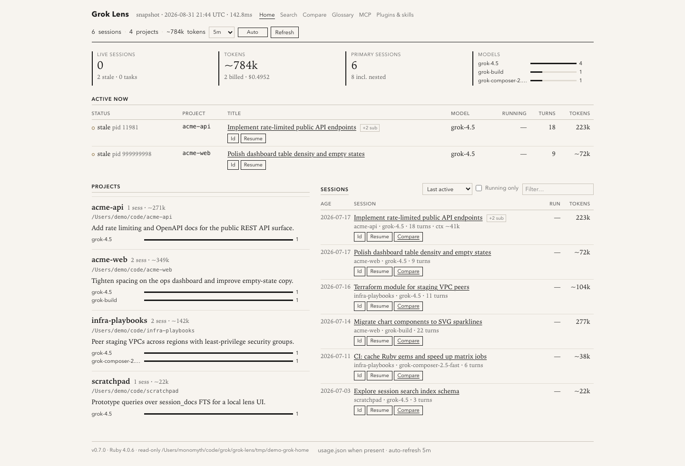

# Grok Lens

[](https://github.com/monomyth/grok-lens/actions/workflows/ci.yml)
[](LICENSE)
[](https://www.ruby-lang.org/)

Local, **read-only** ledger for [Grok Build](https://x.ai/) sessions under `~/.grok` and [Grok Bot](https://x.ai/bot) agents on this Mac.

Ruby **4.x** · Sinatra · dense session ledger

> **Privacy:** Session data can include prompts and code. Binds to `127.0.0.1` by default and never writes to `~/.grok`. See [SECURITY.md](SECURITY.md).

## Features

- **Projects** by working directory — path, short description, model mix, tokens
- **Sessions** — **live** / **stale** / **idle**, models, turns, billed or est. tokens, context window, cost
- **Codex / Cursor** — optional session sources on Home (chips only if discovered)
- **Grok Bot** — separate agent roster (`/bot`): section, working/idle, activity skim when working. Hidden unless agents are discovered
- **Running tasks** — in-flight bg shells / tools / live subagents (with process/port liveness checks)
- **Nested subagents** — `+N sub · K live`
- **Search** — FTS over Grok’s `session_search.sqlite`
- **Compare** — side-by-side metrics for two sessions
- **Copy** session id, `grok --cwd … --resume <id>`, and `grok usage <id>`
- **Light / dark / system** theme (single cycle control)
- **Live polling** re-renders Active + Sessions (any sort/filter) without a full page reload
- **MCP** tab — servers that sessions used, with active / idle / suspended / failed status
- **Glossary** of slash commands · **plugins & skills** inventory
- Sort / filter sessions (last active, running tasks, tokens, title; **Running only** = live process or in-flight tasks)

### Status meanings

| Label | Meaning |
|--------|---------|
| **live** | A Grok process for this session is running (registry and/or `grok --resume …`) |
| **working** | Grok Bot agent whose local replica is still streaming (app must be open) |
| **stale** | Listed open but pid is dead |
| **idle** | No live process |
| **N running** | Live in-flight work units (bg shell, tool, subagent) after liveness checks |

Token **lifetime** figures prefer Grok Build 1.0.14+ **`usage.json`** (the same ledger as `grok usage <session-id>`): billed input/output/cache/reasoning tokens and USD. Completeness is checked against session turn count — a partial ledger (old session that started recording mid-conversation) stays labeled **est.** and the recorded slice is shown separately. Sessions without `usage.json` keep the hybrid estimate (`signals.json` + on-disk sizes). **Context** still comes from `signals.json`. Optional napkin **cost** (`GROK_LENS_USD_PER_M_TOKENS`) is only for sessions without billed totals.

## Requirements

- **Ruby >= 4.0**
- Bundler

```bash
ruby -v   # must report 4.x
```

## Install & run

```bash
git clone https://github.com/monomyth/grok-lens.git
cd grok-lens
bundle install
bundle exec rackup -o 127.0.0.1 -p 9292
# or
bin/grok-lens
```

Open **http://127.0.0.1:9292**

### Options

| Variable | Default | Meaning |
|----------|---------|---------|
| `GROK_HOME` | `~/.grok` | Root of Grok Build data |
| `HOST` | `127.0.0.1` | Bind address |
| `PORT` | `9292` | HTTP port |
| `GROK_LENS_POLL_SECONDS` | `300` | Default auto-refresh (UI can override; `0` = off) |
| `GROK_LENS_USD_PER_M_TOKENS` | unset | **Optional** USD per 1M tokens for est. cost on sessions *without* `usage.json`. Billed cost from the ledger is always shown when present. |
| `GROK_LENS_CONFIG` | `~/.grok-lens.yml` | Optional YAML (`usd_per_m_tokens`) — see `config.example.yml` |
| `GROK_LENS_GROK_BOT` | on | Set `0` to hide Grok Bot agents |
| `GROK_LENS_GROK_BOT_APP` | `~/Library/Application Support/Grok Bot` | Desktop persistence root |
| `GROK_LENS_CODEX` | on | Set `0` to hide Codex |
| `GROK_LENS_CODEX_HOME` | `~/.codex` | Codex data root |
| `GROK_LENS_CURSOR` | on | Set `0` to hide Cursor |
| `GROK_LENS_CURSOR_HOME` | `~/.cursor` | Cursor data root |

```bash
GROK_HOME=/path/to/.grok PORT=9292 bin/grok-lens
```

## Screenshots

Dual-home dashboard (synthetic demo data — not real session history):



## Data sources (read-only)

| Path | Use |
|------|-----|
| `sessions/<cwd>/<id>/summary.json` | Titles, models, counts, times |
| `config.toml` `[mcp_servers]` + plugin `.mcp.json` | MCP roster (no env/headers) |
| `events.jsonl` `mcp_*` | MCP connect / fail / tool-call status |
| `usage.json` | Billed tokens + cost (`grok usage`); per-turn table on session detail |
| `signals.json` | Context tokens / window, turns, tools (when present) |
| `events.jsonl` | Models, tools, activity sparkline |
| `updates.jsonl` | In-flight / background tool status |
| `chat_history.jsonl` | Opening message (wrappers stripped); size for est. |
| `active_sessions.json` + process table | Live / stale sessions |
| `sessions/session_search.sqlite` | FTS search |
| Project `README.md` | Optional project description |
| `~/Library/Application Support/Grok Bot/sand-client-persistence` | Grok Bot roster + transcript replicas |
| `…/sand-session-marker.json` | Grok Bot app liveness |
| `~/.codex/session_index.jsonl` + `sessions/**/rollout-*.jsonl` | Codex threads (prefix only) |
| `~/.cursor/projects/*/agent-transcripts` | Cursor agent transcripts |

## Development

```bash
bundle install
bundle exec rake test
bundle exec rackup -o 127.0.0.1 -p 9292
```

See [CONTRIBUTING.md](CONTRIBUTING.md).

## Project layout

```
grok-lens/
  bin/grok-lens
  config.ru
  config.example.yml
  lib/grok_lens/     # store, estimate, search, catalog, app
  views/
  public/
  test/
  docs/
```

## License

[MIT](LICENSE) · Copyright (c) 2026 Eugene Ray

## Disclaimer

Grok Lens is an independent community tool. It is not affiliated with or endorsed by SpaceXAI. “Grok,” SpaceXAI, and related marks belong to their respective owners.
